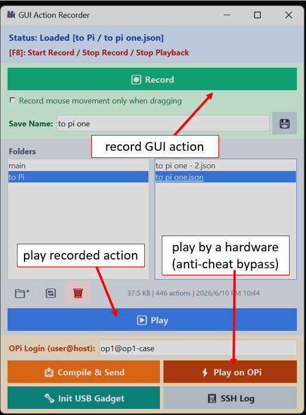

# GUI Action Recorder



A lightweight and premium desktop macro automation suite. It allows you to record, manage, and execute mouse and keyboard actions with pixel-perfect precision.

This project supports two main execution modes:
1. **Local Playback**: Record keyboard and mouse inputs and replay them locally on your computer via software simulation.
2. **Hardware Emulation (Anti-Cheat Bypass)**: Transpile recorded macros into raw USB HID binary packets and execute them using a single-board computer (like Orange Pi) configured as a physical USB OTG keyboard/mouse gadget. Because the host PC detects the Orange Pi as a real physical USB device, it successfully bypasses software-level anti-cheat and macro detection mechanisms.

---

## Features

- **Modern Card-Style UI**: A premium tkinter dashboard with distinct, high-contrast panel colors.
- **Balanced 2x2 Grid Controls**: Fully aligned Orange Pi compilation, playback, device initialization, and SSH logs panel.
- **Topmost Modal Dialogs**: Modals and input popups (such as directory creation and SSH password prompts) automatically inherit topmost focus so they never get hidden behind the main window.
- **Global Hotkey Execution**: Press `[F8]` to start recording, stop recording, or immediately abort macro playback.
- **Drag-and-Drop Management**: Organize recorded macro files into subfolders by dragging files across lists.

---

## Requirements

The application requires Python 3.x and the following external modules:
- **`pynput`**: For recording mouse/keyboard events and local playback.
- **`paramiko`**: For SSH/SFTP communication to the Orange Pi.

---

## Getting Started

### Installation

Clone the repository to your local machine:
```bash
git clone https://github.com/ElenBOT/gui_action_recorder.git
cd gui_action_recorder
```

Install the required dependencies:
```bash
pip install pynput paramiko
```

### Usage

1. **Launch the Application**:
   ```bash
   python action_recorder.py
   ```

2. **Record & Replay Locally**:
   - Press `[F8]` (or click **Record**) to start recording. The window will go semi-transparent.
   - Perform your actions, and press `[F8]` (or click **Stop**) when finished.
   - Enter a filename, select a target folder in the explorer, and click `💾` to save.
   - Select a macro and click **Play** (or press `[F8]`) to replay it.

3. **Orange Pi Hardware Emulation**:
   - Enter your Orange Pi login details (`user@host`) and password in the OPi Panel.
   - Click **Init USB Gadget** to run your remote USB gadget initialization script (`setup_as_km.sh`).
   - Click **Compile & Send** to compile your macro into absolute coordinate binary format and upload it.
   - Click **Play on OPi** to trigger physical playback.
